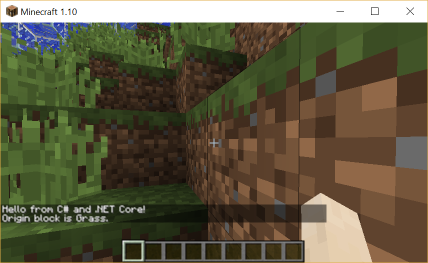

Decent .NET Minecraft Client
============================

A .NET client library for the original (Java) version of Minecraft.
It requires Forge and the Raspberry Jam mod on the Minecraft side.

How to use it
-------------

Requirements: Minecraft (the Java version, not the micro edition or the Windows 10 edition),
[Forge](http://files.minecraftforge.net/), and the [Raspberry Jam Mod](https://github.com/arpruss/raspberryjammod/releases)].

Reference the library, then you can open a connection and start scripting the Minecraft
world:

```csharp
using (var world = JavaWorld.Connect())
{
    world.PostToChat("Hello from C# and .NET Core!");
    var originBlock = world.GetBlockType(0, 0, 0);
    world.PostToChat($"Origin block is {originBlock}.");
}
```



Status
------

This is just a hack at this point: only a minimal number of APIs is implemented,
but the general infrastructure is in place, and the code can actually script Minecraft
from C#, which is pretty awesome in itself.

How does it work?
-----------------

There's [a Minecraft mod that enables scripting Minecraft in Python called Raspberry Jam
Mod](https://github.com/arpruss/raspberryjammod/releases).
The way that mod works is with a small Java mod that lives in Minecraft, accepting socket
connections from a Python client and then exchanging text-based messages that on the wire
look like function calls:

```
world.getBlock(1,0,0)
```

The interesting thing is that there is nothing specific about Python in that protocol:
it's just messages getting exchanged over a socket, which .NET will be happy to emulate.

What I did is to reverse-engineer the Python client code and re-implement it in C#.

Where is this going?
--------------------

Eventually, I'd like to expose the entire Minecraft API with a nice object model,
and to be able to start the C# scripts from the Minecraft console.
That would effectively make it possible to write mods in C#, with a thin Java driver.

CSX support would be nice as well.

I also want to be able to run this with Mono (that should actually already work,
this is just .NET Standard) on a Raspberry Pi: the protocol that Raspberry Jam implements
is natively present on the Raspberry Pi version.

Can I help? - Up for grabs
--------------------------

Sure. Just let me know what you'd like to work on, so we don't duplicate efforts, but yes,
hacking is highly encouraged.

### Blocks

This is an easy contribution.

There's a couple hundred blocks to implement. Some of them, such as `Diamond`, are very simple,
and some are a little more complex, such as `Fire`.
In some cases, such as `Clay`, a class hierarchy makes sense.

If you're interested in implementing blocks, look at the existing blocks in the `Blocks` folder,
then choose one from the `BlockType` enum that doesn't exist yet and implement it.
A block is a class that derives from `Block`.
In the simplest case, the class is empty:

```csharp
public class Diamond : Block
{
    public Diamond() : base(BlockType.Diamond) { }
}
```

The block class is only part of the implementation, that is supposed to be a simple data structure
with no knowledge of the communication protocol with Minecraft.
The code that does know about the protocol must be implemented in `JavaBlock`, in the `JavaBlock`
static constructor, and in the `public static JavaBlock From(Block block)` method.

The static constructor describes how to instantiate the correct block type from data that was
passed in. In simple cases, there is no data, and the block contruction logic can be very simple:

```csharp
_ctors[(int)BlockType.Diamond] = d => new Diamond();
```

In more complex cases, the data must be decomposed and the corresponding properties must be set
on the block object.

The reverse operation implemented in the `From` method is recreating a `JavaBlock` ready to be
transmitted to Minecraft from a concrete block.
If the block you're implementing has no data, nothing has to be implemented, and this part can be
skipped.

The description of the format of the data for each block type that has data can be found in The
[Minecraft documentation wiki Data values page](http://minecraft.gamepedia.com/Data_values).

### Entities

Entities will be an easy contribution once I've started creating the basic infrastructure.

### Commands

This is a medium difficulty contribution.

Very few commands are currently implemented: you can echo messages to the chat using `PostToChat`,
you can get the position of the player using `Player.GetPosition`, and you can get or set a block using
`GetBlock` and `SetBlock`.
Many more commands need to be implemented.
You can find the list of commands and their Python implementation [in the Raspberry Jam Mod GitHub repository](https://github.com/arpruss/raspberryjammod/blob/master/mcpipy/mcpi/minecraft.py).
Make sure you implement both an asynchronous and a synchronous version of each method.
Finally, once you've implemented a command, don't forget to add it to the `IWorld` interface.

### New protocols

This is a difficult contribution.

Currently, this library can only talk to the Java implementation of Minecraft, and to the Raspberry
Pi version (hopefully, I haven't verified it yet).
The code is architected so that it should be possible to implement alternative protocols by
reimplementing `JavaConnection`, `JavaWorld`, and `JavaBlock`.
This way, a single API could in theory be used to script other versions of the Minecraft client and
of Minecraft servers.

Tips and tricks
---------------

It is useful, while developing scripts, to be able to switch to another application without the game going into pause. This can be done by editing the `options.txt` file under your Minecraft folder (`%appdata%\.minecraft\` on Windows, `~/Library/Application Support/minecraft/` on macOS, and `~/.minecraft/` on Linux) and setting `pauseOnLostFocus` to `false`.