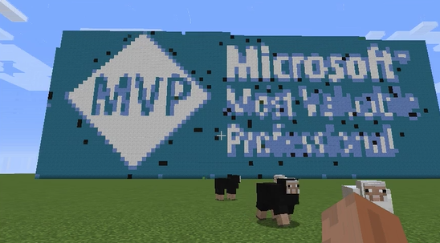

# Automating Minecraft using .NET Core C# client

I've created a small class library at the MVP Summit Hackathon 2016 which automatically creates Minecraft blocks based on a given image.
See an animated gif on <a href="https://t.co/z1mDTfCBoV">Twitter</a>!



```csharp
public static void Main(string[] args)
{
    using (var world = JavaWorld.Connect(args[0]))
    {
        var imageBuilder = new Decent.Minecraft.ImageBuilder.ImageBuilder(world);

        imageBuilder.DrawImage("mvp.jpg", 100);
    }
}
```  

<blockquote class="twitter-tweet" data-lang="en"><p lang="en" dir="ltr">Automated <a href="https://twitter.com/hashtag/Minecraft?src=hash">#Minecraft</a> using the <a href="https://twitter.com/hashtag/dotnetcore?src=hash">#dotnetcore</a> <a href="https://twitter.com/hashtag/csharp?src=hash">#csharp</a> client from <a href="https://twitter.com/bleory">@bleory</a> <a href="https://t.co/okFuaF8GND">https://t.co/okFuaF8GND</a> <a href="https://twitter.com/hashtag/MVPBuzz?src=hash">#MVPBuzz</a> <a href="https://twitter.com/hashtag/mvpsummit2016?src=hash">#mvpsummit2016</a> <a href="https://twitter.com/CoderDojoLinz">@CoderDojoLinz</a> <a href="https://t.co/z1mDTfCBoV">pic.twitter.com/z1mDTfCBoV</a></p>&mdash; Roman Schacherl (@rschacherl) <a href="https://twitter.com/rschacherl/status/796834356455055360">November 10, 2016</a></blockquote>
<script async src="//platform.twitter.com/widgets.js" charset="utf-8"></script>